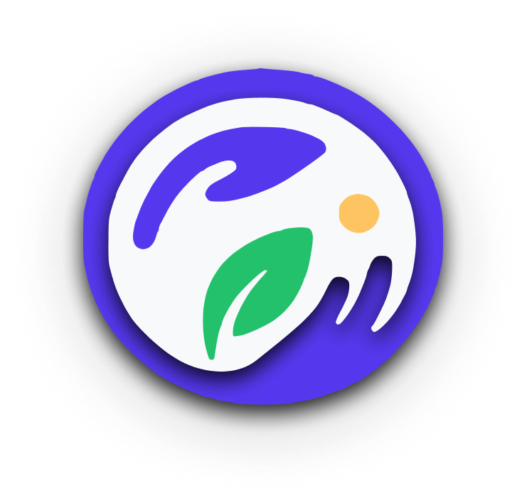
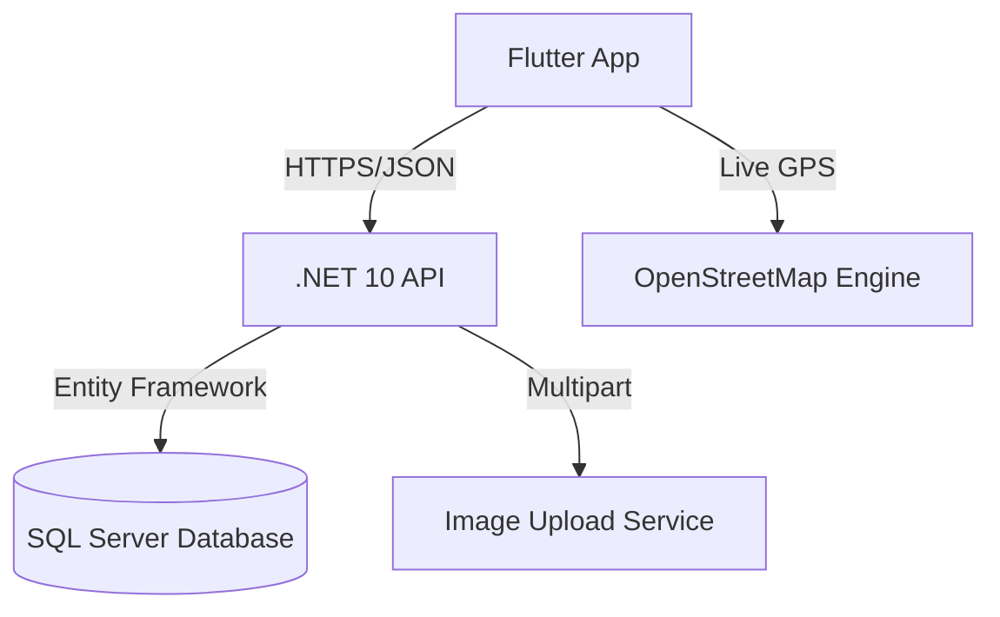

  

<h1 align="center">FEED (Finding Excellent Eats Daily)</h1>

  <strong>Bridging the gap between surplus food and those in need.</strong> 
  A modern, production-ready ecosystem powered by Flutter and .NET 10.

  
  
  
  

---

## 🌟 Overview

**FEED** is a mission-driven platform designed to eliminate food waste through technology. It connects restaurants and individuals (Donors) with local communities (Receivers) via a network of verified volunteers (Riders). 

> [!NOTE]
> This repository is a **technical showcase**. The full source code is private as the platform undergoes preparation for official release on the Google Play Store.

---

## 📺 Live Demo

Experience the full delivery cycle in action—from donor posting to rider tracking.

[**Watch the Demo Video**](https://github.com/MujtabaNite/Finding-Excellent-Eats-Daily-FEED/blob/main/test%20video/WhatsApp%20Video%202026-04-26%20at%207.28.56%20PM.mp4)

---

## 🚀 Key Features

### 🏢 Four-Way User Ecosystem
*   **Donors:** Instantly post surplus meals with photos and location data.
*   **Receivers:** Browse available food or request specific needs in real-time.
*   **Riders:** A streamlined interface for verified volunteers to pick up and deliver meals.
*   **Admins:** A command center to manage users, approve verifications, and resolve reports.

### 📍 Real-Time Logistics
*   **Interactive Mapping:** Powered by OpenStreetMap for zero-cost, high-performance tracking.
*   **Live GPS Tracking:** Receivers can watch their delivery arrive in real-time.
*   **Geocoding:** Automatic conversion of raw coordinates into human-readable addresses.

### 🛡️ Trust & Safety
*   **Rider Onboarding:** A multi-step verification process requiring ID, Vehicle, and License documentation.
*   **Feedback Loop:** Automated flagging system that alerts admins to low-rated interactions.
*   **JWT Security:** Encrypted authentication for all cross-platform data transfers.

---

## 🏗️ System Architecture

---

## 🛠️ Technical Deep Dive

<b>Mobile Implementation (Flutter)</b>

- **State Management:** Provider for scalable, reactive UI updates.
- **Networking:** Custom Dio client with Bearer Token interceptors.
- **Hardware:** Image Picker and Location services integration.
- **Mapping:** `flutter_map` with custom marker layers and real-time positioning.

<b>Backend Implementation (.NET 10)</b>

- **Database:** Relational SQL Server schema with strict foreign key constraints.
- **Security:** JWT-based Auth with role-based claim authorization.
- **File Handling:** Multipart image processing for verification documents.
- **Automation:** Background logic to convert negative ratings into high-priority admin reports.

---

## 📸 Screenshots

| Donor Dashboard | Real-Time Tracking | Rider Verification |
| :---: | :---: | :---: |
| _(Image Placeholder)_ | _(Image Placeholder)_ | _(Image Placeholder)_ |

---

## ©️ Copyright and License

**All Rights Reserved.**

This repository serves as a portfolio showcase for the **FEED platform**. The designs, app branding, and technical concepts are the intellectual property of the developer. No part of this repository may be copied or used for commercial purposes without explicit permission.
